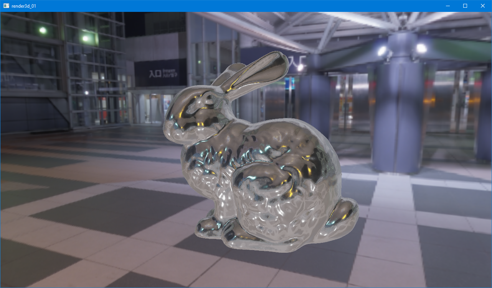
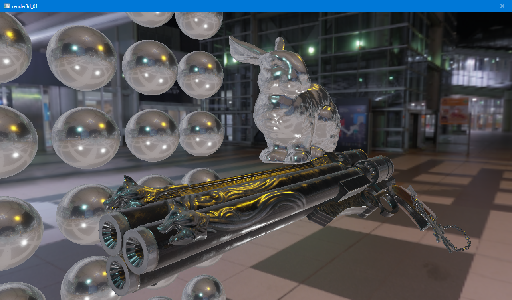
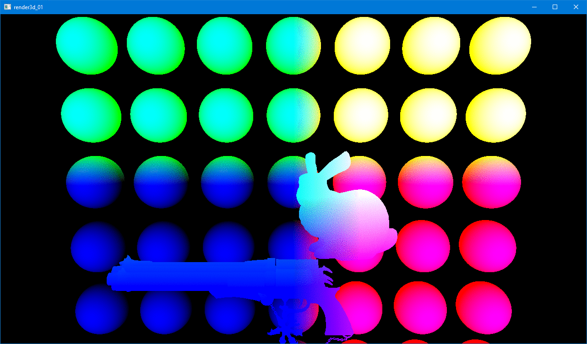

# render3d_01

A very basic modern OpenGL PBR Renderer 

## Features
- Deferred Rendering
    - G-Buffer contains positions, normals and PBR textures 
- Physically based shading (Cook-Torrance BRDF only)
- Environment maps and Image Based Lighting (IBL)
    - Diffuse part using irradiance maps
    - Specular part using Split Sum Approximation i.e. split specular radiance integral so that we can use two prefiltered textures
- FPS-style camera control
- Wavefront OBJ loader

## Dependencies
- OpenGL 3.0+
- [SDL2 2.0.9](https://www.libsdl.org/) (For window creation and input handling)
- [glad](https://glad.dav1d.de/) (OpenGL Loading Library)
- [rw](https://github.com/raywan/rw) - Vectors, Matrices, Quaternions, Timers (My libraries for games/graphics)
- [tinyobjloader](https://github.com/syoyo/tinyobjloader) (Alternative OBJ loader from self-written one)

## Screenshots
<!--   -->

## Assets
- [Cerberus by Andrew Maximov](https://www.artstation.com/artwork/3k2)
- [Stanford Bunny](http://graphics.stanford.edu/data/3Dscanrep/)
- [Tokyo BigSight by Bochi (HDR environment map)](http://www.hdrlabs.com/sibl/archive.html)

## Resources
- [Learn OpenGL - PBR](https://learnopengl.com/PBR/Theory)
- [CodingLabs - Physically Based Rending - Cook–Torrance](http://www.codinglabs.net/article_physically_based_rendering_cook_torrance.aspx)
- [Real-time Rendering 4th Edition](http://www.realtimerendering.com/)
- [PBRT](https://www.pbrt.org/)